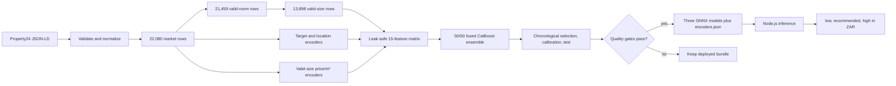

# Property valuation model architecture

This document describes the implemented Property24 asking-price pipeline. The
source of truth is [`src/property_model`](src/property_model); this is the
current system, not a proposed design.

## Overview



| Module | Responsibility |
| --- | --- |
| [`data.py`](src/property_model/data.py) | Normalize raw JSON-LD, preserve useful incomplete rows, and report cohorts/exclusions. |
| [`features.py`](src/property_model/features.py) | Fit hierarchical encoders and build the fixed numeric matrix. |
| [`modeling.py`](src/property_model/modeling.py) | Fit fused CatBoost models, produce temporal predictions, and calibrate intervals. |
| [`evaluation.py`](src/property_model/evaluation.py) | Calculate forward metrics and release gates. |
| [`train.py`](src/property_model/train.py) | Train, verify, export, and atomically promote the bundle. |

## 1. Data cohorts

The scraper stores each listing ID once in `data/raw/YYYY-MM-DD.jsonl`, using
Property24's `datePosted`. Training reads those files in lexical order and
requires the filename and `datePosted` to agree. Invalid JSON, invalid IDs, or
duplicate IDs stop training.

Only ZAR sale listings for houses, apartments/flats, and townhouses in
Gauteng, KwaZulu Natal, and the Western Cape enter the market cohort. Required
market fields are date, country, region, city, suburb, type, and an asking
price from R50,000 to R200,000,000. Rental and out-of-scope listings are hard
exclusions.

The current history is partitioned without losing otherwise useful listings:

| Cohort | Rows | Use |
| --- | ---: | --- |
| Market | 22,080 | Target encodings, location support counts, and market priors. |
| Valid rooms | 21,459 | Market rows with both bedroom and bathroom counts. |
| Valid size | 13,898 | Direct model training, forward evaluation, and size-dependent features. |

Bedrooms and bathrooms are accepted for training from 0.5 to 20 in half-step
increments. Missing, non-finite, out-of-range, or other fractional room values
become missing; the listing remains in the market cohort. Floor size is valid
from 10 to 5,000 m² when its asking price is also between R500 and R500,000 per
m². An invalid or missing size likewise remains available to non-size market
encoders.

This distinction is deliberate: structural gaps do not erase valid evidence
about location and asking price, while the deployed regressor remains directly
size-aware and trains only on rows that match its required inputs.

## 2. Features and leakage control

The ONNX graph consumes a fixed 15-column `float32` tensor. Categorical values
are converted to smoothed numeric encodings because CatBoost categorical
features are not exported in this graph.

Geography uses composite keys so same-named places do not collide:

```text
region
region|city
region|city|suburb
```

Target encodings use `log1p(price)` and all market rows. Price/m² encodings use
`log(price / size)` and only rows with valid size. Both use hierarchical
smoothing with strength 10 and back off from suburb to city to region to the
global mean. Unknown locality counts fall back to zero.

The feature order persisted in `encoders.json` and enforced by Node is:

| # | Feature | Definition |
| ---: | --- | --- |
| 1 | `bedrooms` | Bedroom count. |
| 2 | `bathrooms` | Bathroom count. |
| 3 | `size` | Floor size in m². |
| 4 | `size_missing` | Missing-size indicator; zero for size-cohort training and serving. |
| 5 | `total_rooms` | `bedrooms + bathrooms`. |
| 6 | `bed_bath_ratio` | `bedrooms / (bathrooms + 0.5)`. |
| 7 | `size_per_bedroom` | `size / max(bedrooms, 0.5)`. |
| 8 | `log_size` | Natural log of size. |
| 9–12 | `te_region`, `te_locality_1`, `te_locality_2`, `te_type` | Smoothed log-price encodings. |
| 13 | `te_ppsqm` | Hierarchical log price/m² encoding. |
| 14 | `prior_log_price` | `te_ppsqm + log_size`. |
| 15 | `loc2_log_count` | `log1p` market-row count for the composite suburb. |

Training features use deterministic random inner out-of-fold encoding. For
each inner fold, its listing IDs are removed from the broader encoder cohort,
so no row's target contributes to its own features. Final serving encoders use
all 22,080 market rows because a new request has no observed target. There is
no recency-weighted encoder or price index.

## 3. Selected models and intervals

All models predict `log1p(price)`. The selected direct-target model is a 50/50
CatBoost ensemble fused with `catboost.sum_models` before ONNX export:

| Member | Iterations | Learning rate | Depth | L2 |
| --- | ---: | ---: | ---: | ---: |
| Base | 700 | 0.05 | 6 | 6 |
| Depth-8 override | 700 | 0.03 | 8 | 15 |

The same blend is used for the MAE point model and the P10/P90 quantile models.
Fusion preserves the existing one-file-per-output serving contract. A staged
model that predicted a residual from a time-varying prior was benchmarked and
rejected because it did not beat this direct size-aware ensemble.

The raw P10–P90 band is a nominal 80% interval. The penultimate chronological
fold supplies split-conformal scores:

```text
score = max(min(q10, q90) - actual_log_price,
            actual_log_price - max(q10, q90))
```

The finite-sample 80th-percentile score is constrained to a non-negative
log-space widening and applied symmetrically. The lower ZAR bound is clamped
to zero, crossed quantiles are ordered, and the point prediction is clamped
inside the final interval.

## 4. Forward evaluation and gates

Outer folds are expanding chronological windows based on `date_posted`.
Encoders and models for each validation window use only earlier rows. The early
outer folds form the model-selection report, the penultimate fold calibrates
the interval, and the newest fold is the untouched test. Only the inner OOF
encoding described above is random.

The current test result is MdAPE 17.82%, RMSLE 0.345, log-space R² 0.836,
53.95% within 20%, median bias −1.31%, interval coverage 79.37%, and median
relative interval width 77.03%.

On the 1,977 listings shared by the previous and new cleaners in the untouched
13–18 September test window, both recipes were retrained only on earlier rows:

| Metric | Previous | Current |
| --- | ---: | ---: |
| MdAPE | 20.51% | 17.59% |
| MAE | R691,503 | R620,916 |
| RMSLE | 0.364 | 0.338 |
| Within 20% | 48.76% | 54.78% |
| Median bias | −3.84% | −1.43% |
| Interval coverage | 83.92% | 80.37% |
| Median interval width | 100.48% | 77.79% |

Promotion requires every configured gate to pass on the newest test fold:

- MdAPE ≤19%.
- Log-space R² ≥0.80.
- RMSLE ≤0.36.
- At least 52% of predictions within 20%.
- Absolute median percentage bias ≤5%.
- Interval coverage from 75% to 85%.
- Median relative interval width ≤84%.

`build/metrics.json` also reports RMSE, MAE, median absolute error, MAPE,
WAPE, within-10%, selection/CV metrics, and province/property-type slices.
`build/data-quality.json` records cohort conservation and hard exclusions.

## 5. Export and production contract

After the gates pass, final encoders are fit from all market rows, with the
price/m² tables restricted to their valid-size subset. A leakage-safe OOF
matrix is built for the 13,898 size-cohort rows, and the fused point/P10/P90
models are trained. The staged bundle is checked against native Python
predictions before atomic promotion.

The artifact shape is unchanged:

```text
models/
├── encoders.json
├── model.onnx
├── model_q10.onnx
└── model_q90.onnx
```

`encoders.json` contains the exact feature order, composite lookup tables,
counts, globals, size-imputation tables, conformal widening, cohort counts,
source dates, hashes, selected model/data labels, and test metrics.
[`tests/verify-onnx.cjs`](tests/verify-onnx.cjs) independently recreates Node
features and requires finite, ordered predictions matching native CatBoost
within relative tolerance `1e-5` or absolute tolerance R1.

The public API and Node inference contract did not change. `POST` accepts:

```json
{"region":"Western Cape","locality_1":"Cape Town","locality_2":"Sea Point","type":"House","bedrooms":3,"bathrooms":2,"size":120}
```

Public bedrooms and bathrooms remain integers from 1–20; half-step rooms are a
training-data capability only. Size must be 10–5,000 m². `locality_2` may be
empty or omitted and then uses the city/region/global fallback. Extra fields
are rejected. The response remains
`{"low":number,"recommended":number,"high":number}` in ZAR.

Node validates the encoder schema and exact feature order, loads and caches
the three ONNX sessions, constructs one `[1, 15]` tensor, and applies the same
inverse-log and interval rules as Python. Model failures return HTTP 500,
invalid input returns 400, unsupported methods return 405, and responses use
`Cache-Control: no-store`.

## 6. Limitations

- The target is an advertised asking price, not a completed transaction, bank
  valuation, guaranteed sale value, or pricing-strategy optimum.
- Coverage is limited to supported Property24 categories and three provinces;
  sparse or unseen locations rely on broader fallback means.
- The model has no condition, amenity, erf-size, exact-coordinate, text, or
  image features.
- Listings are immutable first captures, so the model does not observe price
  revisions, sale outcomes, or time on market.
- Probable relists and development duplicates are not grouped beyond unique
  listing ID.
- The nominal 80% interval is empirical and can vary by market segment or as
  the market changes.

## Reproduce

From the repository root:

```sh
npm run train
npm run test:onnx -w @property-prices/model
npm run prepare:models -w @property-prices/function
npm test
```

Training writes reports under `packages/model/build` and promotes the verified
bundle to `packages/model/models`.
