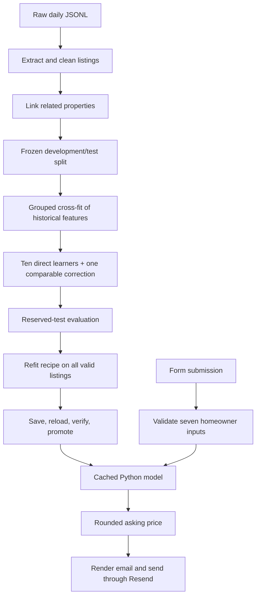

# Asking-price pipeline

Start with `src/property_model/train.py`. It shows the complete training flow;
each module it calls owns one stage. The webhook enters through `main.py`; direct prediction uses
`property_model predict` (CLI). Both use the same feature and model code.

This estimates **advertised residential asking prices in ZAR**. It does not
estimate completed sale prices. Its feature construction and blend can be
explained step by step; the eleven fitted tree models are not a simple causal
explanation of a home's value.



## 1. Raw documents → cleaned properties (`data.py`)

Read daily files and lines in order. The first JSON-LD graph object supplies the
asking price; a cached root price is not authoritative. Breadcrumb positions 2,
3 and 4 supply province, city and suburb. Province/suburb use address fields
only if the respective breadcrumb position is absent. Bedrooms, bathrooms and
floor area prefer the property's JSON-LD fields; root fields are fallbacks
when those fields are absent. Rates come from `ratesAndTaxes` and are treated
as monthly municipality rates, never levies. Explicit null is not replaced by
a fallback value.

Normalize geography with whitespace collapsing and Unicode case folding;
normalize `kwazulu-natal` to `kwazulu natal`. Unknown text becomes `__unknown__`.
Keep built residential listings with finite asking prices of at least R10,000.
Remove the demo's literal rental phrases and nonresidential property types.
There is no upper price cutoff and no restriction to complete measurements.

| Field | Valid historical and model-input range |
|---|---|
| Bedrooms, bathrooms | 0–100, including fractions |
| Floor size | 5–100,000 m² |
| Rates | R0–R1,000,000 |

Invalid historical measurements become missing. Invalid supplied model values
are rejected; callers can explicitly send null or omit an unknown value.
Numeric strings and booleans are not model inputs. The email form retains its
existing, narrower required-input limits.

Keep the last repeated listing ID after sorting by posting date and snapshot
date. Record malformed rows, exclusions, corrected measurements and counts in
`build/data-quality.json`. No raw files are rewritten.

## 2. Cleaned properties → related groups and a reserved test

Link records transitively by any of:

- A normalized street address containing a digit in the same geography.
- The same nonempty full image URL.
- A long normalized marketing description in the same geography with matching
  bedrooms, bathrooms and floor size.

Preserve the demo's grouping order, since seeded splits depend on group labels.
Grouping does not delete advertisements. Counts are listing counts, not
necessarily independent homes. Conservative linkage can group multiple units
at one address, and some relistings may remain undetected.

`train.reserve_test` reserves 20% of groups with seed 20260925 and writes
`data/splits.json`. Whole groups stay on one side. The raw-data hash is locked;
changed data requires an explicitly different `--splits` path. Never regenerate
a split to obtain a better score.

The development model is evaluated against the reserved test. The production
model subsequently learns from all valid data, including former test rows.
Consequently the reported test score measures the development-trained recipe,
not independent accuracy of the final all-data fitted artifact. A production
artifact is rejected by the independent evaluation command.

## 3. Properties → 70 features (`features.py`, `comparables.py`)

`config.FEATURE_COLUMNS` is the single ordered feature contract. Both branches
consume exactly this matrix; missing numerical features stay missing.

| Feature family | Count | Meaning |
|---|---:|---|
| Structural | 24 | Geography, four measurements, missingness, logs, ratios and size band |
| Historical summaries | 36 | Six statistics across six market groups |
| Comparables | 10 | Local reference price, support, distance and dispersion |

### Structural features

Five location categories describe province, city, suburb, `province|city`, and
`province|city|suburb`. Four raw numbers are followed by each number's missing
flag and `log1p` transform. Five ratios describe bathrooms/bedroom, area/bedroom,
area/bathroom, rates/area and rates/bedroom. Zero denominators become missing.
Add bedrooms × bathrooms and an area band with upper boundaries 50, 100, 150,
250, 400, 800 and infinity. Upper boundaries belong to the lower band.

LightGBM receives the saved categorical dictionaries; unknown categories become
missing codes. CatBoost receives category strings. Neither model uses property
type as an input, although type remains useful for cleaning historical data.

### Historical summaries

Build groups for province, city hierarchy, suburb hierarchy, suburb + bedrooms,
city + bedrooms + bathrooms, and city + size band. Each supplies count, median
log price, sample log-price standard deviation, median log price/m², median
area and median rates. Missing statistics stay missing; an unseen group's
count is zero.

Only median log price is smoothed:

```text
smoothed = (count × local_median + 10 × parent_estimate) / (count + 10)
```

Province falls back to the global median, city to province, and suburb to city.
The three structural groups all use the subject's smoothed suburb estimate as
parent, including the groups keyed at city level. This preserves the demo's
recipe rather than substituting a different hierarchy.

### Comparable listings

Choose the first pool with at least five rows: suburb, city, province, otherwise
global. Compare `[bedrooms/2, bathrooms/2, log(area), log1p(rates)]`, weighted
`[1, 1, 2, 1.5]`. Use only shared measurements, divide by shared weights, and
add `0.25 × fraction_of_unshared_measurements`. Stable distance ordering breaks
ties using historical row order.

Take five nearest listings and weight them by `exp(-3 × distance)`. Adjust each
log asking price by `0.5 × clip(log(subject_area / comparable_area), -0.7, 0.7)`;
apply no area correction if either area is unknown. Their weighted median is
`comp_log`, the comparable reference price in log space. Other features record
support counts, fallback level, price/m², distance and dispersion.

### The leakage boundary

A training row must not supply its own asking price to summaries or comparables.
`training_features` uses four shuffled grouped folds, seed 119. Each held fold
gets historical features built exclusively from the other groups. All linked
advertisements are excluded together. Structural features need no cross-fit.

At prediction time, `prediction_features` uses the saved full training
reference. A new homeowner's price is unknown and never an input. The test
reference contains development rows only. The production reference contains
all cleaned rows.

## 4. Features → predictions (`modeling.py`)

The settings are frozen in `config.py`, with no search framework or alternate
model branches:

1. Fit ten LightGBM models on `log(price)` with seeds
   7, 19, 41, 67, 101, 137, 211, 307, 419, 523. Each has 2,200 estimators,
   learning rate 0.04, 63 leaves, minimum child size 30, L2 40, feature fraction
   0.8, and absolute-error objective.
2. Calculate residual targets `log(price) - comp_log`, subtract their median,
   and fit CatBoost with 3,000 iterations, depth 6, rate 0.025 and Huber loss.
   Restore the saved median when predicting the correction.
3. Exponentiate each direct learner separately, then average in price space.
   Exponentiate the corrected comparable log price separately. Log outputs
   are clipped to [0, 25] before exponentiation.
4. Blend the two branch prices equally and multiply once by 0.98.
5. Round the result to the nearest R1,000 using Python's ties-to-even rounding.

When all four numeric inputs are unknown, replace all branch outputs with the
median price from the selected geographic pool before applying 0.98. The
reported comparable count is zero, distance fields and model disagreement are
null, and missing inputs are listed. Do not interpret arbitrary nearest
neighbors with no shared measurements as meaningful structural comparisons.

The model also returns the unrounded price, comparable estimate, geographic
counts, fallback, distances, dispersion and model disagreement. These are
**diagnostics, not calibrated confidence probabilities or price intervals**.

## 5. Evaluation and artifact publication

`evaluation.py` writes metrics, individual predictions and segment tables to
`build/reports`. Mainstream is defined by development-price percentiles 10–90,
not selected by performance on the test. The report includes within-20%, MdAPE,
MAE, RMSE, log error, bias and a grouped bootstrap interval for mainstream
within-20% accuracy. The bootstrap interval describes an aggregate metric;
it is not a property price range.

`artifacts.py` saves ten native LightGBM text files, CatBoost's native model,
`market.joblib` (plain reference data and category dictionaries), and a manifest.
The manifest contains feature/settings contracts, package versions, source
hashes, file checksums, training IDs, data audit, split hash and evaluation.
Only load trusted artifacts: Joblib is a Python deserialization format.

Publish only after integrity checks, reload, prediction comparison and exact
rounded-price comparison pass. On save or publication failure preserve the
previous bundle. Simultaneous writers to one model directory are unsupported.

## 6. Serving and reading order

`main.py` is the single HTTP orchestration boundary: parse the completed form
submission, predict with the cached model, render the email, and send it.
`valuation.py` owns the submission validation, form-to-model mapping, Jinja2
rendering and bounded Resend request. These serving files sit outside the model
package so training and feature code remain independent of HTTP and email.
Neither serving file calculates features, adjusts prices, or re-rounds outputs.
The model loads once per process. Invalid submissions never invoke prediction
or delivery; failed predictions never send email. The webhook returns no model
JSON: direct prediction and diagnostics remain available through the CLI.

Read in order: `train.py`, `data.py`, `features.py`, `comparables.py`,
`modeling.py`, `evaluation.py`, `artifacts.py`, then `main.py` and `valuation.py`.
See [the worked example](WALKTHROUGH.md) for actual intermediate values.
