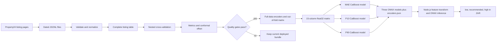

# Property valuation model architecture

This document describes the implemented property valuation pipeline end to
end: how Property24 JSON-LD becomes training rows, how those rows become
leakage-safe numeric features, how the three models are evaluated and trained,
and how the exported bundle becomes a production valuation in South African
rand (ZAR).

The source of truth is the code in [`src/property_model`](src/property_model).
This document describes the current system; it is not a proposed design.

## System overview



The main package responsibilities are:

| Module | Responsibility |
| --- | --- |
| [`data.py`](src/property_model/data.py) | Read, validate, deduplicate, and normalize raw JSON-LD. |
| [`features.py`](src/property_model/features.py) | Fit encoders and build the fixed numeric feature matrix. |
| [`modeling.py`](src/property_model/modeling.py) | Fit point and quantile CatBoost models, run nested CV, and calibrate intervals. |
| [`evaluation.py`](src/property_model/evaluation.py) | Calculate metrics and enforce release quality gates. |
| [`train.py`](src/property_model/train.py) | Orchestrate evaluation, final fitting, ONNX verification, and atomic promotion. |
| [`__main__.py`](src/property_model/__main__.py) | Expose `python -m property_model train`. |

## 1. Raw data and the training row

### Collection and storage

The upstream scraper searches Property24 for houses, apartments/flats, and
townhouses in the Western Cape, Gauteng, and KwaZulu Natal. Each unseen listing
ID is stored once as one line in `data/raw/YYYY-MM-DD.jsonl`, where the filename
comes from the listing's `datePosted`. The accumulated dated files are the
training history; training does not use the filename or publication date as a
feature.

Each raw line has this outer contract:

```json
{
  "id": 123456789,
  "jsonld": [
    { "@graph": ["Property24 JSON-LD nodes"] }
  ]
}
```

`load_data` reads files matching `????-??-??.jsonl` in lexical order. Blank
lines are ignored. Invalid JSON, an invalid ID, or a duplicate ID anywhere in
the history stops training. IDs must be integers and booleans are not accepted
as integers. Duplicate detection happens before completeness filtering, so an
incomplete listing still reserves its ID.

### JSON-LD extraction

`normalize_raw` scans JSON-LD documents and their `@graph` nodes, returning the
first node that produces a complete record. It extracts:

| Normalized field | JSON-LD source | Rule |
| --- | --- | --- |
| `id` | Raw envelope `id` | Integer listing identifier; not a model feature. |
| `country` | `about.address.addressCountry` | Required non-blank string. |
| `region` | `about.address.addressRegion` | Required non-blank string. |
| `locality_1` | `breadcrumb.itemListElement[2].name` | Required non-blank string, normally the city-level location. |
| `locality_2` | `about.address.addressLocality` | Required non-blank string for training. |
| `type` | `about.description`, falling back to `about.@type` | Required non-blank string. |
| `bedrooms` | `about.numberOfBedrooms` | Positive finite number. |
| `bathrooms` | `about.numberOfBathroomsTotal`, falling back to `about.numberOfBathrooms` | Positive finite number. |
| `size` | `about.floorSize.value` | Positive finite number, treated as square metres. |
| `price` | `offers.priceSpecification.price` | Positive finite target, accepted only when `priceCurrency` is exactly `ZAR`. |

Numeric strings may contain commas. Booleans, nulls, non-numeric values,
non-finite values, zero, and negative values are rejected. A raw listing that
is structurally valid but has no complete graph node is skipped. At least
`max(20, 2 * cv_splits)` complete rows are required; with the current
configuration this minimum is 20.

The resulting pandas table contains one row per usable listing. `price` is the
supervised target. The seven serving inputs are `region`, `locality_1`,
`locality_2`, `type`, `bedrooms`, `bathrooms`, and `size`; `country` is also
present during training and is fixed to `South Africa` by production inference.

## 2. Feature engineering

CatBoost categorical features are not used because the deployed CatBoost ONNX
graph consumes a numeric tensor. All categorical information is converted to
numeric encodings before fitting. The exact feature order is saved in
`encoders.json`; both Python and Node build a `float32` tensor in that order.

### Hierarchical smoothed encodings

Two quantities are encoded:

- Target encoding: `y = log1p(price)`.
- Price-per-square-metre encoding: `yp = log(price / size)`.

For category value `c`, the smoothed value is:

```text
TE(c) = (n_c * mean_c + m * parent_c) / (n_c + m)
```

where `n_c` is the category count, `mean_c` is its observed mean, `parent_c` is
the parent mean, and `m` is the configured smoothing strength. The current
values are `m = 10` for both encoding families. More observations therefore
give the category mean more weight; rare categories shrink toward a broader
geography.

The target-encoding parents are:

```text
country -> global log-price mean
region -> global log-price mean
type -> global log-price mean
locality_1 -> raw mean for its modal region
locality_2 -> raw mean for its modal locality_1
```

The price-per-square-metre encoding exists for `region`, `locality_1`, and
`locality_2`, with the analogous global -> region -> locality hierarchy. If a
location name appears under multiple parents, its parent is the most frequent
(mode) association in the fitting data. Parent means used for smoothing are
raw group means, not the already-smoothed parent encodings.

At inference, an unseen value backs off as follows:

| Requested encoding | Fallback chain |
| --- | --- |
| `country`, `region`, or `type` target encoding | Global mean. |
| `locality_1` target encoding | Region, then global mean. |
| `locality_2` target encoding | Locality 1, region, then global mean. |
| `locality_2` price/m² encoding | Locality 1, region, then global mean `log(price / size)`. |
| `locality_2` count | Zero, which becomes `log1p(0) = 0`. |

### Final feature vector

The models consume exactly 15 features:

| Position | Feature | Definition |
| ---: | --- | --- |
| 1 | `bedrooms` | Numeric bedroom count. |
| 2 | `bathrooms` | Numeric bathroom count. |
| 3 | `size` | Floor size in square metres. |
| 4 | `total_rooms` | `bedrooms + bathrooms`. |
| 5 | `bed_bath_ratio` | `bedrooms / (bathrooms + 0.5)`. |
| 6 | `size_per_bedroom` | `size / max(bedrooms, 0.5)`. |
| 7 | `log_size` | `log(max(size, 1e-9))`. |
| 8 | `te_country` | Smoothed mean `log1p(price)` for country. |
| 9 | `te_region` | Smoothed mean `log1p(price)` for region. |
| 10 | `te_locality_1` | Hierarchical smoothed mean `log1p(price)` for locality 1. |
| 11 | `te_locality_2` | Hierarchical smoothed mean `log1p(price)` for locality 2. |
| 12 | `te_type` | Smoothed mean `log1p(price)` for property type. |
| 13 | `te_ppsqm` | Hierarchical smoothed mean `log(price / size)` for locality 2. |
| 14 | `prior_log_price` | `te_ppsqm + log_size`, an implied location price/m² prior for log-price. |
| 15 | `loc2_log_count` | `log1p(number of fitting rows in locality_2)`. |

### Leakage prevention

Target-derived features cannot be calculated naively: doing so would let a
listing's own price influence its inputs, especially for singleton locations.
The package uses different encoder fitting strategies for training and
serving:

- `build_oof_matrix` randomly divides the training rows into five deterministic
  folds. Each fold is transformed with encoders fitted only on the other four
  folds. Every final training row is therefore encoded without its own target.
- `fit_encoders` fits on all available rows only for the exported serving
  lookup tables. A new request has no known target, so using all historical
  training observations is valid and provides the strongest estimates.

The split permutation is reproducible for the configured seed. It is not
stratified, grouped by property, or ordered by time.

## 3. Models and prediction interval

All models are `CatBoostRegressor` instances trained against
`log1p(price)`. Log-space training reduces the dominance of the most expensive
properties and makes relative errors more important. There are three models:

| Artifact | Training loss | Purpose |
| --- | --- | --- |
| `model.onnx` | `MAE` | Recommended point estimate. |
| `model_q10.onnx` | `Quantile:alpha=0.1` | Raw lower conditional quantile. |
| `model_q90.onnx` | `Quantile:alpha=0.9` | Raw upper conditional quantile. |

The shared CatBoost configuration in [`config/model.json`](config/model.json)
is:

| Parameter | Value |
| --- | ---: |
| Trees (`iterations`) | 700 |
| Learning rate | 0.05 |
| Tree depth | 6 |
| L2 leaf regularization | 6.0 |
| Minimum data per leaf | 1 |
| Random strength | 0.0 |
| Bagging temperature | 2.0 |
| Random seed | 42 |

Training is quiet and disables CatBoost's auxiliary file output. There is no
hyperparameter search in this pipeline.

### Conformal quantile calibration

The P10-P90 models nominally describe an 80% interval. Their empirical band is
calibrated from cross-validated predictions. For every row, first order the two
log-space quantiles:

```text
a_i = min(q10_i, q90_i)
b_i = max(q10_i, q90_i)
score_i = max(a_i - log1p(price_i), log1p(price_i) - b_i)
```

For `n` scores and `alpha = 0.2`, the calibration quantile level is:

```text
min(1, ceil((n + 1) * (1 - alpha)) / n)
```

NumPy's `higher` quantile produces one scalar log-space offset `w`. Production
applies it symmetrically:

```text
low  = expm1(min(q10, q90) - w)
high = expm1(max(q10, q90) + w)
recommended = clamp(expm1(point_prediction), low, high)
```

Ordering the quantile outputs protects against crossing P10/P90 predictions;
clamping guarantees `low <= recommended <= high`. The implementation does not
clamp the lower price to zero. Although named a widening value, `w` is not
explicitly constrained to be non-negative and can mathematically contract an
already conservative interval.

## 4. Evaluation and release gates

### Nested cross-validation

Evaluation uses five outer folds. For each outer fold:

1. Hold out the outer validation rows.
2. Fit serving-style encoders on the outer training rows only.
3. Create an inner five-fold out-of-fold matrix from the outer training rows.
4. Fit the point, P10, and P90 models on that matrix.
5. Transform the outer validation rows with the outer-training encoders.
6. Predict the held-out rows.

After all folds, every row has a point and quantile prediction from models and
encoders that never saw its target. This prevents feature and model leakage
during scoring. The conformal offset and interval coverage are then calculated
from this complete set of outer-fold predictions; there is no separate final
calibration or test set.

### Reported metrics

`build/metrics.json` records the configured parameters plus:

| Metric | Definition |
| --- | --- |
| `rmse` | Root mean squared price error. |
| `mae` | Mean absolute price error. |
| `medae` | Median absolute price error. |
| `rmsle` | Root mean squared error between `log1p` actual and non-negative clipped predicted prices. |
| `r2` | R² in ZAR price space. |
| `r2_log` | R² in `log1p` price space. |
| `mape` | Mean absolute percentage error. |
| `mdape` | Median absolute percentage error. |
| `within_10` | Percentage of predictions within 10% of the listing price. |
| `within_20` | Percentage of predictions within 20% of the listing price. |
| `interval_coverage_pct` | Percentage of prices inside the calibrated interval. |
| `interval_median_relative_width_pct` | Median interval width divided by the point prediction. |

The generated metrics report is written before gate evaluation. Model
promotion continues only when all current gates pass:

- `MdAPE <= 25%`
- `log-space R² >= 0.7`
- `75% <= interval coverage <= 85%`

A failure raises an error and leaves the existing deployment bundle untouched.
Metrics characterize random cross-validation over the collected data, not
performance on a future time period or an independent external dataset.

## 5. Final fitting, export, and promotion

After evaluation passes:

1. Fit serving encoders on the complete normalized dataset and store the
   calibrated interval offset in them.
2. Build a fresh five-fold out-of-fold feature matrix over the complete data.
3. Fit the point, P10, and P90 models on that matrix and the full
   `log1p(price)` target.
4. Export all three CatBoost models to ONNX in a temporary staging directory.
5. Save the lookup tables, feature order, smoothing metadata, locality counts,
   global means, and interval offset in `encoders.json`.
6. Verify the staged bundle from Node.js and atomically replace `models/` only
   after verification succeeds.

The deployment bundle must contain exactly:

```text
models/
├── encoders.json
├── model.onnx
├── model_q10.onnx
└── model_q90.onnx
```

[`tests/verify-onnx.cjs`](tests/verify-onnx.cjs) reconstructs the feature vector
in Node, executes all three ONNX models against fixed verification records, and
compares `{low, recommended, high}` with native CatBoost predictions. Values
must be finite and match within relative tolerance `1e-5` or absolute tolerance
ZAR 1. The interval must also be ordered. This test protects the Python-to-Node
feature and artifact contract.

Promotion temporarily moves the old bundle to `.models-backup`, moves the
verified stage into place, restores the backup if replacement fails, and
removes the backup after success. Generated models are not committed; a clean
checkout can rebuild them from raw history.

## 6. Production inference contract

The production implementation is
[`packages/function/src/inference.ts`](../function/src/inference.ts). The HTTP
endpoint accepts only `POST` JSON with no extra properties:

```json
{
  "region": "Western Cape",
  "locality_1": "Cape Town",
  "locality_2": "Sea Point",
  "type": "House",
  "bedrooms": 3,
  "bathrooms": 2,
  "size": 120
}
```

`region`, `locality_1`, and `type` must be non-blank strings. `locality_2` is
optional in production and becomes an empty string, causing the normal
locality-1/region/global fallback. The numeric fields must be greater than
zero. Country is not accepted from callers and is fixed to `South Africa`.

The service loads and caches `encoders.json` and the three ONNX sessions,
recreates the same 15 features, submits one `[1, 15]` float32 tensor to each
model, applies interval calibration and inverse log transforms, and returns:

```json
{
  "low": 2800000.0,
  "recommended": 3500000.0,
  "high": 4300000.0
}
```

All values are ZAR estimates. `recommended` is the point-model prediction,
bounded by `low` and `high`; `low` and `high` are uncertainty bounds, not
guaranteed sale-price limits. Invalid requests return HTTP 400, unsupported
methods return 405, and model failures propagate as server errors. Responses
use `Cache-Control: no-store`.

## 7. Assumptions and limitations

- **The target is an advertised price.** It is not a completed transaction,
  bank valuation, or independently appraised market value. Seller pricing and
  stale listings can bias it.
- **Coverage follows the scraper.** The collected data is limited to supported
  Property24 categories and three South African provinces. Predictions outside
  well-represented combinations rely increasingly on broader fallback means.
- **Only complete training listings are used.** Missing locality 2, room counts,
  floor size, or ZAR price causes exclusion, which can create selection bias.
- **The model has no condition or amenity inputs.** It cannot directly account
  for age, renovation quality, views, parking, erf size, security, exact
  coordinates, or other omitted price drivers.
- **Location labels are identity-sensitive.** Spelling, casing, renamed areas,
  and inconsistent hierarchy labels can turn known categories into fallbacks.
- **Validation is random rather than temporal.** The reported metrics do not
  measure forward-looking drift, market regime change, or degradation after
  deployment. No automated drift monitor exists.
- **Rows are not grouped beyond unique listing ID.** Near-duplicate properties
  or relisted homes with different IDs can appear across folds.
- **The interval is empirically calibrated, not a guarantee.** Its nominal 80%
  interpretation depends on future listings resembling the calibration data;
  coverage can differ by location, property type, and price segment.
- **No model selection is performed.** The configured feature set,
  hyperparameters, and gates are fixed engineering choices rather than results
  of an automated tuning experiment.

## Reproducing the pipeline

From the repository root, after installing the Python package and Node
dependencies:

```sh
npm run train
npm run test:onnx -w @property-prices/model
```

Training reads all dated files under `data/raw`, writes the evaluation report
to `packages/model/build/metrics.json`, and promotes the verified bundle to
`packages/model/models`. The complete repository test command is `npm test`.
