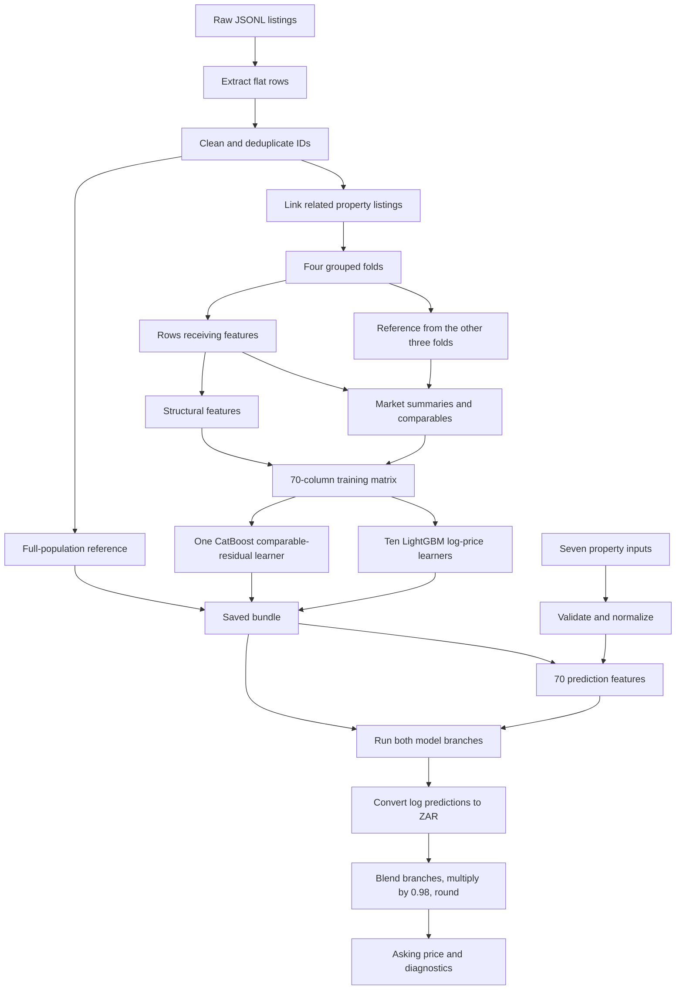

# From raw listings to asking-price predictions: worked examples

This model learns **advertised asking prices in ZAR** from Property24 listings. It does not learn completed sale prices. It uses structured measurements and market evidence, not a language model, image analysis, or text embeddings.

We will follow **A: listing 117090236**, a three-bedroom house in Durbanville Hills, through the entire pipeline. **B: listing 117084970**, a two-bedroom townhouse in Goedemoed, shows what happens when rates are missing. Other real records expose cleaning and grouping behavior.

All numerical examples below were computed with this repository's functions and existing saved models on **2026-09-27**. Tables round intermediate values to six decimals unless shown as currency; calculations retain full precision. `ln` means natural logarithm; `NaN` means an internal missing numeric value, while `null` is JSON's missing value.

## Reading map

1. [The two data paths](#1-the-two-data-paths)
2. [Raw records and extraction](#2-raw-records-and-extraction)
3. [Cleaning and property grouping](#3-cleaning-and-property-grouping)
4. [Structural features](#4-structural-features)
5. [Training folds and historical reference](#5-training-folds-and-historical-reference)
6. [Market-summary transformations](#6-market-summary-transformations)
7. [Comparable-listing transformations](#7-comparable-listing-transformations)
8. [The 70 inputs and model targets](#8-the-70-inputs-and-model-targets)
9. [Prediction through both branches](#9-prediction-through-both-branches)
10. [Missing inputs and unseen locations](#10-missing-inputs-and-unseen-locations)
11. [Saved artifacts, forms, and completion](#11-saved-artifacts-forms-and-completion)
12. [Reproduce and check the examples](#12-reproduce-and-check-the-examples)

## 1. The two data paths

The code now follows the same stages as this walkthrough. Start with [`train()`](src/property_model/train/main.py) and [`predict()`](src/property_model/inference/main.py). A **record** is a Python dictionary, and each stage takes or returns a list of records. `records_to_feature_matrix()` is the explicit boundary where feature dictionaries become the 70-column DataFrame accepted by the learners.

The training flow reads like this:

```python
records, source_audit, labels = read_records(data_directory)
records, cleaning_audit = clean_records(records)
records = assign_property_groups(records)
feature_records = build_training_features(records)
model = train_models(records, feature_records)
```

[`market.py`](src/property_model/market.py) owns group statistics and the shrinkage hierarchy. [`features.py`](src/property_model/features.py) combines structural, aggregate, and comparable feature dictionaries. [`comparables.py`](src/property_model/comparables.py) handles neighbor selection and price arithmetic. Numerical kernels and persisted reference tables still use NumPy/pandas to preserve the trained recipe's statistical behavior.



Training has both property inputs and known asking prices. Prediction receives only property inputs and uses the saved historical population. The numeric-empty override described in section 10 replaces the branch outputs before blending.

| Stage | Input | Output |
| --- | --- | --- |
| Read/extract | One nested JSON object per line | Flat row plus source audit |
| Clean | Flat rows with mixed numeric/string values | Valid rows, missing-value corrections, geography keys |
| Group | Cleaned rows and linking metadata | A property-group label per row |
| Construct training features | Subject rows and other-fold reference data | A 29,207 × 70 matrix |
| Fit | Feature matrix plus transformed price targets | Ten direct learners and one residual learner |
| Predict | One or more seven-field objects and saved bundle | One 70-feature row per property, then branch outputs |
| Format | Blended ZAR predictions and evidence diagnostics | A list of prediction objects, even for one input |

The current data audit is **147 files → 29,926 extracted rows → 29,207 valid rows → 27,984 property groups**. There are no malformed lines and no repeated listing IDs in this snapshot. There are 719 excluded rows.

The raw-data fingerprint is:

```text
d322d349bb699a980e29abe8ea8d1175ca22a61353f08b7d189cf06ea1f3953e
```

This is the implementation's SHA-256 over sorted filenames and line contents, not a hash of concatenated file bytes including newlines. The saved manifest records the same fingerprint, row count, and group count. Artifacts and predictions can change after retraining or changing the raw files.

## 2. Raw records and extraction

Source: [`read_records`, `raw_to_record`](src/property_model/train/data.py).

### The example set

| Listing / source link | JSONL line | Why it is here |
| --- | --- | --- |
| [117090236](../../data/raw/2026-04-02.jsonl#L1) | 1 | A — complete measurements; full worked path |
| [117084970](../../data/raw/2026-04-01.jsonl#L1) | 1 | B — rates absent |
| [117290071](../../data/raw/2026-06-05.jsonl#L6) | 6 | Floor area below allowed minimum |
| [117331459](../../data/raw/2026-06-18.jsonl#L221) | 221 | Bedroom and bathroom counts above maximum |
| [117347948](../../data/raw/2026-06-24.jsonl#L121) | 121 | Rates above maximum |
| [117324577](../../data/raw/2026-06-17.jsonl#L64) | 64 | Low price and rental wording |
| [117315069](../../data/raw/2026-06-12.jsonl#L140) | 140 | Rental wording despite a plausible sale price |
| [117290172](../../data/raw/2026-06-05.jsonl#L16) | 16 | Commercial listing |
| [117296688](../../data/raw/2026-06-08.jsonl#L86) | 86 | Zero bedrooms; division-by-zero behavior |
| [117289827](../../data/raw/2026-06-05.jsonl#L5) | 5 | First member of linked group |
| [117301304](../../data/raw/2026-06-09.jsonl#L95) | 95 | Second member of linked group |

The links point to the dated raw JSONL files; line numbers identify exact records. A JSONL line is a complete JSON object.

### A: a relevant excerpt of the original JSON

Fields unrelated to this walkthrough are omitted here. Names, types, and values below are preserved from the raw record.

```json
{
  "id": 117090236,
  "jsonld": [
    {
      "@graph": [
        {
          "datePosted": "2026-04-02",
          "breadcrumb": {
            "itemListElement": [
              {
                "position": 2,
                "name": "Western Cape"
              },
              {
                "position": 3,
                "name": "Durbanville"
              },
              {
                "position": 4,
                "name": "Durbanville Hills"
              }
            ]
          },
          "about": {
            "@type": "House",
            "numberOfBedrooms": 3,
            "numberOfBathroomsTotal": 3,
            "floorSize": {
              "@type": "QuantitativeValue",
              "value": 343,
              "unitCode": "MTK"
            },
            "address": {
              "@type": "PostalAddress",
              "streetAddress": "13 Race Course Road",
              "addressLocality": "Durbanville Hills",
              "addressRegion": "Western Cape",
              "addressCountry": "South Africa"
            },
            "description": "House"
          },
          "offers": {
            "priceSpecification": {
              "@type": "UnitPriceSpecification",
              "price": "5250000",
              "priceCurrency": "ZAR"
            }
          },
          "description": "House For Sale in Durbanville Hills Durbanville Western Cape",
          "image": "https://images.prop24.com/377036271/Ensure960x540"
        }
      ]
    }
  ],
  "price": 5250000,
  "bedrooms": 3,
  "bathrooms": 3,
  "size": 343,
  "ratesAndTaxes": 3180
}
```

### Nested values become a flat row

In this table, `listing` means `record["jsonld"][0]["@graph"][0]`, and `about` means `listing["about"]`.

| Flat field | Raw source / fallback | A after extraction |
| --- | --- | --- |
| id | Top-level id, converted to text | "117090236" |
| price | listing.offers.priceSpecification.price | "5250000" (still text) |
| province | Breadcrumb position 2; absent position → addressRegion | western cape |
| city | Breadcrumb position 3 | durbanville |
| suburb | Breadcrumb position 4; absent position → addressLocality | durbanville hills |
| bedrooms | about.numberOfBedrooms; absent key → top-level bedrooms | 3 |
| bathrooms | about.numberOfBathroomsTotal; absent key → top-level bathrooms | 3 |
| floor_size | about.floorSize.value; absent key → top-level size | 343 |
| rates | Top-level ratesAndTaxes | 3180 |
| date / snapshot | listing.datePosted / source filename stem | 2026-04-02 / 2026-04-02 |
| kind / property_type | about.@type / about.description | House / House |
| street | about.address.streetAddress, normalized | 13 race course road |
| image / description | listing.image / listing.description | Preserved for grouping and filtering |

`normalize_text()` strips surrounding whitespace, case-folds text, collapses whitespace, and replaces `kwazulu-natal` with `kwazulu natal`. An absent or empty location becomes `__unknown__`. For example, the **synthetic normalization example** `"  KwaZulu-Natal  "` becomes `"kwazulu natal"`.

The top-level `price` is **not** the price source, even though it agrees in A. Python `.get(key, fallback)` uses its fallback when the key is absent, not when an existing value is `null`. A present-but-null nested measurement therefore does not automatically fall back to the top-level measurement. A `null` object where extraction expects a dictionary can instead make a line malformed.

The extractor uses the first JSON-LD item and first graph item. Expected extraction/JSON errors are recorded with file and line and skipped. It does not search other graph entries for a usable listing.

Latitude, longitude, pets, agent details, top-level address and listing-date strings are not used by this model. No currency or floor-area unit conversion is performed: the pipeline assumes the source's ZAR and m² conventions. `rates` keeps the source's numeric rates-and-taxes amount without a billing-period conversion.

## 3. Cleaning and property grouping

Source: [`clean_records`, `assign_property_groups`](src/property_model/train/data.py), [`LIMITS`](src/property_model/config.py).

### Row rejection versus missing measurements

First, price and the four measurements pass through `pd.to_numeric(errors="coerce")`. A's `"5250000"` becomes numeric `5250000`; unparseable text becomes `NaN`. There is no currency-symbol or thousands-separator parser at this stage.

A row is excluded if any of these conditions holds:

- Price is nonfinite or below R10,000. There is no upper price cutoff.
- Listing description contains `to let`, `to rent`, `for rent`, or `available for rental`, case-insensitively with word boundaries.
- It is not considered residential: `kind` must be `Apartment` or `House`, **or** `property_type` must contain `house`, `apartment`, `townhouse`, or `flat`, case-insensitively.

For rows that survive, out-of-range measurements become `NaN`; the row and its price remain.

| Measurement | Inclusive accepted range | Invalid values changed to missing in this snapshot | Total missing after cleaning |
| --- | --- | --- | --- |
| bedrooms | 0–100 | 2 | 2 |
| bathrooms | 0–100 | 1 | 1 |
| floor_size | 5–100,000 | 43 | 10,414 |
| rates | 0–1,000,000 | 5 | 11,304 |

The correction counts count numeric out-of-range/nonfinite values among retained rows; already-missing values and text coerced to `NaN` do not count as corrections.

| Example | Before cleaning | After cleaning / decision |
| --- | --- | --- |
| A: 117090236 | price `"5250000"`; 3 beds, 3 baths, 343 m², rates 3180 | Retained; price is numeric; all measurements valid |
| B: 117084970 | `ratesAndTaxes: null` | Retained; `rates = NaN` |
| 117290071 | `floor_size = 2`, price R950,000 | Retained; `floor_size = NaN` |
| 117331459 | 123 beds, 123 baths, price R115,000,000 | Retained; beds and baths become `NaN`; price stays R115,000,000 |
| 117347948 | `rates = 2400000` | Retained; `rates = NaN` |
| 117324577 | price R7,800; “Batchelors flat to let in Uitzicht” | Excluded by both low-price and rental rules |
| 117315069 | price R585,000; “Spacious 1.5 Bedroom Apartment for Rent in Carrington Heights” | Excluded by rental wording |
| 117290172 | `kind = Place`, `property_type = Commercial Property` | Excluded as nonresidential |

Those rules are literal heuristics. Listing 117331459 describes a 60-unit investment opportunity, yet survives as an apartment. “Cleaned residential data” does not guarantee one ordinary dwelling per record. Rejection reasons can overlap; 719 is the number of excluded rows, not a sum of independent reason counts.

### Repeated IDs and related-property groups are different

After cleaning, rows are sorted by `date`, then `snapshot`; the last row per listing ID is kept. Dates are source strings, not parsed timestamps. There are no repeated IDs in the current snapshot, so this removes zero rows. As a **synthetic rule example**, if an otherwise-valid ID appears with snapshots `2026-09-01` and `2026-09-02` at the same date, the latter wins.

Geography adds two string keys:

```text
city_key   = western cape|durbanville
suburb_key = western cape|durbanville|durbanville hills
```

Related rows then get a shared `group` if any linking key matches:

- Normalized street containing a digit, together with province/city/suburb.
- A nonempty, exactly matching image URL, without a geography requirement.
- A description longer than 60 characters, normalized and combined with geography and the string forms of beds, baths, and area.

Links are transitive. Price is not part of a linking key. The group label is an internal row-root number, not a stable property identifier.

| Listing | Price (ZAR) | Beds / baths / area | Street | Group |
| --- | --- | --- | --- | --- |
| 117289827 | 1300000 | 2.0 / 1.5 / 109.0 | 259 john zikhali road | 64 |
| 117301304 | 1090000 | 2.0 / 1.0 / 93.0 | __unknown__ | 64 |

These two records share `https://images.prop24.com/380767443/Ensure960x540`, so both join group 64 despite different measurements and prices. This is a protective grouping heuristic, not proof they are the same dwelling. **Both rows remain in training and in the saved reference.** Grouping keeps them together when dividing training folds; it does not collapse them into one comparable.

IDs, prices, descriptions, image URLs, streets, dates, kinds, and group labels do not become direct model-input columns. Price is the target and the source of historical price evidence; the other fields serve extraction, filtering, provenance, or grouping.

## 4. Structural features

Source: [`calculate_structural_features`](src/property_model/features.py), [`area_to_size_band`](src/property_model/records.py).

This stage needs only the property's inputs, not other listings. It produces **24 columns**: five geography strings, four measurements, eight missing/log features, five ratios, one room product, and one size band.

### A and B side by side

The following table contains all 24 structural features. These values are the same in training and prediction for the same cleaned inputs.

| Feature | Transformation / meaning | A | B |
| --- | --- | --- | --- |
| province | Normalized province | western cape | western cape |
| city | Normalized city | durbanville | durbanville |
| suburb | Normalized suburb | durbanville hills | goedemoed |
| city_key | Province + city | western cape\|durbanville | western cape\|durbanville |
| suburb_key | Province + city + suburb | western cape\|durbanville\|durbanville hills | western cape\|durbanville\|goedemoed |
| bedrooms | Original cleaned bedroom count | 3 | 2 |
| bathrooms | Original cleaned bathroom count | 3 | 1 |
| floor_size | Original cleaned area, m² | 343 | 51 |
| rates | Original cleaned rates amount | 3180 | NaN |
| bedrooms_missing | 1 if bedrooms is missing, otherwise 0 | 0 | 0 |
| log_bedrooms | ln(1 + bedrooms) | 1.386294 | 1.098612 |
| bathrooms_missing | 1 if bathrooms is missing, otherwise 0 | 0 | 0 |
| log_bathrooms | ln(1 + bathrooms) | 1.386294 | 0.693147 |
| floor_size_missing | 1 if floor_size is missing, otherwise 0 | 0 | 0 |
| log_floor_size | ln(1 + floor_size) | 5.840642 | 3.951244 |
| rates_missing | 1 if rates is missing, otherwise 0 | 0 | 1 |
| log_rates | ln(1 + rates) | 8.064951 | NaN |
| bathrooms_per_bedrooms | bathrooms / bedrooms; zero denominator → NaN | 1 | 0.5 |
| floor_size_per_bedrooms | floor_size / bedrooms; zero denominator → NaN | 114.333333 | 25.5 |
| floor_size_per_bathrooms | floor_size / bathrooms; zero denominator → NaN | 114.333333 | 51 |
| rates_per_floor_size | rates / floor_size; zero denominator → NaN | 9.271137 | NaN |
| rates_per_bedrooms | rates / bedrooms; zero denominator → NaN | 1060 | NaN |
| rooms_product | bedrooms × bathrooms | 9 | 2 |
| size_band | Right-closed area interval | (250.0, 400.0] | (50.0, 100.0] |

For A, `log_floor_size = ln(1 + 343) = 5.840642`, and `floor_size_per_bedrooms = 343 / 3 = 114.333333 m² per bedroom`. Original numeric values remain alongside the transformed values; this is not a replacement or standardization step.

Logarithms compress large values and express multiplicative changes as additive differences: `ln(2 × x) - ln(x) = ln(2)`. The `+1` in these structural features also makes zero valid: `ln(1 + 0) = 0`. Price targets and comparable areas use `ln(x)` without `+1` because their cleaned values must be positive. Ratios give the learners another view of the same inputs, such as how much floor area there is per bedroom.

For B, absent rates propagate to `log_rates`, `rates_per_floor_size`, and `rates_per_bedrooms`, and `rates_missing` becomes 1. There is no mean/median imputation of these measurements. The downstream learners receive numeric missing values as such.

Zero bedrooms are allowed. Real listing 117296688 has 0 beds, 1 bath, and 45 m²: `log_bedrooms = 0`, `bedrooms_missing = 0`, `rooms_product = 0`, but `bathrooms_per_bedrooms` and `floor_size_per_bedrooms` are `NaN`. Zero and missing carry different information.

Area bands are `(0,50]`, `(50,100]`, `(100,150]`, `(150,250]`, `(250,400]`, `(400,800]`, and `(800,inf]`. For example, exactly 50 falls in the first band and 51 in the second. Missing/invalid area produces `__unknown__` in the installed pandas version; listing 117290071 demonstrates this after its 2 m² value is removed.

## 5. Training folds and historical reference

Source: [`build_training_features`](src/property_model/train/main.py), [`build_market_reference`](src/property_model/market.py).

Price-derived features cannot be constructed from a row's own price during training. `GroupKFold` divides the population into four folds, shuffled with seed 119. For each fold, a reference is built from the other three folds, then used to calculate the held fold's market summaries and comparables. All members of a property group stay together.

| Fold (numbered here from 1) | Reference rows | Rows receiving features |
| --- | --- | --- |
| 1 | 21925 | 7282 |
| 2 | 21871 | 7336 |
| 3 | 21903 | 7304 |
| 4 | 21922 | 7285 |

A is cleaned row index 2, in group 2, and receives its historical features in **fold 4**. Its reference contains **21,922 rows**, and A and its group are absent. Each fold calculates complete feature dictionaries and writes them back to their original record positions. After every fold is processed, those dictionaries are converted to the ordered model matrix.

The explicit fold loop in `build_training_features()` is:

```python
features_in_original_order = [None] * len(records)
for reference_positions, feature_positions in create_property_group_folds(records):
    reference_records = [records[position] for position in reference_positions]
    records_receiving_features = [records[position] for position in feature_positions]
    market_reference = build_market_reference(reference_records)
    fold_features = add_features(records_receiving_features, market_reference)
    for position, features in zip(feature_positions, fold_features):
        features_in_original_order[position] = features
```

Each returned fold contains positions in the original list. `reference_records` supply prices; `records_receiving_features` supply only the subject measurements and lookup keys to feature construction. Explicit assignment keeps every feature row aligned with its own target price.

These are **feature-construction folds**, not four separately evaluated production models. All 29,207 feature rows then train every production learner. There is no held-out accuracy report in this flow.

“Historical” means “from the reference population,” not “posted before the subject.” The folds are not chronological. A was posted in April, but its reference includes later listings. No age weighting, inflation adjustment, or time feature is applied.

`build_market_reference()` returns:

| Reference item | Contents | Used for |
| --- | --- | --- |
| `pool` | Five location columns, four measurements, price, and three derived group keys | Summary groups and reference rows |
| `log_prices` | `ln(price)` for each pool row | Comparable estimates |
| `global_log_price` | Median of reference log prices | Top-level shrinkage parent |
| `numeric` | Four similarity coordinates per row | Comparable distances |
| `tables` | Six groups of market statistics | 36 aggregate features |
| `indices` | Row indices by province, city key, suburb key | Selecting comparable pools |

The saved inference reference is rebuilt from **all 29,207 rows**, not a fold. It stores the measurements and prices needed to calculate evidence at prediction time. It does not store raw descriptions, image URLs, or listing IDs; the manifest separately records training IDs.

## 6. Market-summary transformations

Source: [`add_market_group_keys`, `build_market_reference`, `calculate_aggregate_features`](src/property_model/market.py).

### Step 1: decide which rows belong together

Each subject is looked up in six kinds of group. Here are A's exact lookup strings; float-valued counts explain the `3.0` text.

| Group prefix | Meaning | A lookup key |
| --- | --- | --- |
| province | All listings in the province | western cape |
| city_key | All listings in province + city | western cape\|durbanville |
| suburb_key | All listings in province + city + suburb | western cape\|durbanville\|durbanville hills |
| bed_key | Suburb + bedrooms | western cape\|durbanville\|durbanville hills\|3.0 |
| config_key | City + bedrooms + bathrooms | western cape\|durbanville\|3.0\|3.0 |
| size_key | City + area band | western cape\|durbanville\|(250.0, 400.0] |

Missing bed/bath counts become `-1.0` in these lookup keys. These three extra lookup keys are not themselves categorical model features; their resulting statistics are numeric features.

### Step 2: summarize prices and measurements

For every group, the reference computes median `ln(price)`, row count, sample standard deviation of `ln(price)`, median `ln(price / floor_size)`, median area, and median rates. Measurement-dependent summaries ignore missing measurements. Row count includes all group prices even when area or rates is missing; it is not the count of usable areas.

### Step 3: shrink the log-price median toward a broader parent

Only the `logmedian` feature is shrunk. With `SHRINKAGE = 10`:

```text
estimate = (count × local_median_log_price + 10 × parent_estimate) / (count + 10)
```

For A in fold 4:

```text
global parent = 14.253765488895429
province = (5999 × 14.930652148583594 + 10 × global) / 6009
         = 14.929525693832904
city     = (313 × 15.249403897883443 + 10 × province) / 323
         = 15.239500547912838
suburb   = (2 × 15.175532880939564 + 10 × city) / 12
         = 15.228839270083958
bed      = (1 × 15.150511624696614 + 10 × suburb) / 11
         = 15.221718575048744
```

Province shrinks toward global, city toward the shrunk province, and suburb toward the shrunk city. **Bed, configuration, and size groups each shrink toward the shrunk suburb**, even though configuration and size membership are city-based. They do not form a further chain.

An absent group has count 0 and inherits its parent's log-price estimate; its other statistics remain missing. A one-row group's sample dispersion is `NaN`. A's bed group has one row without area, so its price-per-m² and typical-area features are also missing.

### All 36 aggregate model inputs for A's training row

Each cell is a separate feature named `{row prefix}_{column suffix}`; for example, `city_key_count = 313`.

| Prefix | logmedian | count | dispersion | logppm | typical_area | typical_rates |
| --- | --- | --- | --- | --- | --- | --- |
| province | 14.929526 | 5999 | 0.896006 | 10.121162 | 117 | 1200 |
| city_key | 15.239501 | 313 | 0.640745 | 10.088312 | 194 | 1570 |
| suburb_key | 15.228839 | 2 | 0.035385 | 9.902237 | 200 | 880 |
| bed_key | 15.221719 | 1 | NaN | NaN | NaN | 880 |
| config_key | 15.264484 | 11 | 0.357745 | 10.060446 | 210 | 1632 |
| size_key | 15.589777 | 44 | 0.28197 | 9.97686 | 288 | 2060.5 |

`logmedian`, `dispersion`, and `logppm` are in log space; `typical_area` is m² and `typical_rates` is the original rates unit. Exponentiating a shrunk log median gives a price-level estimate, but these summaries enter the learners as features; they are not individually returned as the recommendation.

For an even number of observations, `exp(median(log(price)))` is the geometric midpoint of the middle two prices, which need not equal `median(price)`.

## 7. Comparable-listing transformations

Source: [`calculate_comparable_features` and helpers](src/property_model/comparables.py).

This branch constructs ten more **features**. The comparable estimate is deterministic arithmetic over listings, not another fitted learner.

### Step 1: select a geographic pool

Use the subject's suburb if it contains at least five rows; otherwise try its city, then province, then all reference rows. Select one pool, rather than progressively filling five slots from different levels. Fallback codes are suburb `0`, city `1`, province `2`, global `3`.

A's fold-4 reference has 2 suburb rows, 313 city rows, and 5,999 province rows. Thus it uses the **313-row city pool**. These are counts of listings, not unique property groups.

### Step 2: map measurements into similarity coordinates

```text
coordinates = [bedrooms / 2, bathrooms / 2, ln(floor_size), ln(1 + rates)]
A           = [1.5,          1.5,           5.837730447,    8.064950892]
weights     = [1,            1,             2,              1.5]
```

Notice that this area's coordinate is `ln(area)`, while the earlier model feature is `ln(1 + area)`. These are different transformations for different purposes. There are no latitude/longitude coordinates here.

### Step 3: calculate distances using shared measurements

For each candidate:

```text
distance = sum(weight × absolute coordinate difference, over shared finite values)
           / max(sum(shared weights), 0.1)
           + 0.25 × (1 - number_of_shared_measurements / 4)
```

For candidate 117501782 (3 beds, 3 baths, 356 m², rates 3770), all four measurements are shared:

```text
distance = [2 × abs(ln(343) - ln(356))
            + 1.5 × abs(ln(3181) - ln(3771))] / 5.5
         = 0.059930450
```

Candidate 117452674 has matching beds/baths but no area or rates. Its measurement difference is 0, but its missing penalty is `0.25 × (1 - 2/4) = 0.125`. Missing values are not treated as zero measurements. If no measurements are shared, distance is 0.25; this is a modest penalty and can still make a poorly described listing competitive with more complete ones.

Take the five smallest distances. Ties retain reference order because sorting is stable. Price is not used to rank similarity.

### Step 4: weight neighbors and adjust their prices for area

```text
weight             = exp(-3 × distance)
area_log_adjustment = 0.5 × clip(ln(subject_area) - ln(neighbor_area), -0.7, 0.7)
adjusted_log_price  = ln(neighbor_price) + area_log_adjustment
```

When either area is missing, the adjustment is 0. Without clipping, this multiplies price by `sqrt(subject_area / neighbor_area)`; clipping caps the log adjustment at ±0.35.

These are A's actual five training comparables, in nearest-first order:

| Neighbor ID | Price ZAR | Beds | Baths | Area | Rates | Distance | Weight | Area log adjustment | Adjusted price ZAR |
| --- | --- | --- | --- | --- | --- | --- | --- | --- | --- |
| 117501782 | 10890000 | 3 | 3 | 356 | 3770 | 0.05993 | 0.835445 | -0.0186 | 10689316.61 |
| 117573442 | 5995000 | 3 | 2.5 | 390 | 3458 | 0.115002 | 0.708217 | -0.064208 | 5622169.62 |
| 117452674 | 3895000 | 3 | 3 | NaN | NaN | 0.125 | 0.687289 | 0 | 3895000 |
| 117505183 | 5995000 | 3 | 2.5 | 323 | 2500 | 0.132893 | 0.671205 | 0.030039 | 6177816.24 |
| 117528183 | 6750000 | 3 | 3.5 | 330 | NaN | 0.144319 | 0.648589 | 0.019319 | 6881670.32 |

Raw neighbor records: [117452674](../../data/raw/2026-07-27.jsonl#L178) (line 178), [117501782](../../data/raw/2026-08-05.jsonl#L181) (line 181), [117505183](../../data/raw/2026-08-06.jsonl#L182) (line 182), [117528183](../../data/raw/2026-08-14.jsonl#L181) (line 181), [117573442](../../data/raw/2026-08-29.jsonl#L58) (line 58).

### Step 5: take a weighted median, not a mean

Sort by adjusted log price, accumulate weights, and take the first adjusted log price whose cumulative weight reaches half the total. The weights total 3.550745, so the halfway point is 1.775372.

| Neighbor, sorted by adjusted price | Adjusted log price | Weight | Cumulative weight |
| --- | --- | --- | --- |
| 117452674 | 15.175204 | 0.687289 | 0.687289 |
| 117573442 | 15.542228 | 0.708217 | 1.395506 |
| 117505183 | 15.636475 | 0.671205 | 2.066712 |
| 117528183 | 15.744372 | 0.648589 | 2.7153 |
| 117501782 | 16.184755 | 0.835445 | 3.550745 |

The median lands on **117505183**:

```text
comp_log = ln(5995000) + 0.5 × ln(343 / 323)
         = 15.636475408415393
exp(comp_log) = R6,177,816.244021152
```

### All ten comparable model inputs for A's training row

| Feature | A value | Meaning |
| --- | --- | --- |
| comp_log | 15.636475 | Weighted median of area-adjusted log prices |
| comp_count | 5 | Number of selected neighbors |
| comp_closest | 0.05993 | Smallest selected distance |
| comp_distance | 0.112717 | Distance-weighted mean selected distance |
| comp_dispersion | 0.340312 | Weighted root mean square deviation of adjusted log prices from comp_log |
| comp_logppm | 9.877372 | Unweighted median ln(original price / original area) among selected usable rows |
| comp_fallback | 1 | 1 = city pool |
| comp_province_n | 5999 | Reference province row count |
| comp_city_key_n | 313 | Reference city row count |
| comp_suburb_key_n | 2 | Reference suburb row count |

`comp_dispersion` is not the same statistic as a group summary's sample standard deviation. `comp_logppm` uses original prices, not the area-adjusted prices, and does not use similarity weights.

## 8. The 70 inputs and model targets

Source: [`FEATURE_COLUMNS`, model parameters](src/property_model/config.py), [`train_models`](src/property_model/train/main.py).

### Complete feature dictionary and matrix layout

The tables in sections 4, 6, and 7 together give **every value of A's 70-column training row**. The order is fixed:

| Positions (1-based) | Feature family | Count | Interpretation |
| --- | --- | --- | --- |
| 1–5 | `province`, `city`, `suburb`, `city_key`, `suburb_key` | 5 | Geography strings |
| 6–9 | `bedrooms`, `bathrooms`, `floor_size`, `rates` | 4 | Cleaned numeric inputs |
| 10–17 | `{measurement}_missing`, then `log_{measurement}`, per measurement in the order above | 8 | Missingness and `ln(1+x)` |
| 18–22 | `bathrooms_per_bedrooms`, `floor_size_per_bedrooms`, `floor_size_per_bathrooms`, `rates_per_floor_size`, `rates_per_bedrooms` | 5 | Ratios |
| 23–24 | `rooms_product`, `size_band` | 2 | Interaction and categorical area band |
| 25–60 | Six summary prefixes, each with the six suffixes in section 6's table order | 36 | Reference market statistics |
| 61–70 | Ten comparable features in section 7's table order | 10 | Local price estimate and support |
| Total | 6 categorical + 64 numeric features | **70** | No price/ID/group column in the matrix |

### Categorical values entering each learner

The five geography columns and `size_band` are categorical. During fitting, their values become strings, and the sorted observed values are recorded in `categories`.

- **LightGBM:** those six columns become pandas categoricals using the saved levels. The library consumes their categorical encoding. Unseen values become missing categories; the application does not add new category levels at prediction time.
- **CatBoost:** those columns remain strings and are explicitly identified as categorical inputs. Its own categorical handling is inside the saved model; this pipeline does not manually one-hot encode them.

For both branches, numeric missing values remain missing. No scaler, numeric mean-imputer, or hand-built one-hot feature matrix sits between these features and the learners.

### Direct target: learn log asking price

Each of the ten LightGBM learners gets the same 29,207 × 70 matrix and target vector:

```text
y_direct = ln(price)
A: ln(5250000) = 15.473738634567807
```

The seeds are 7, 19, 41, 67, 101, 137, 211, 307, 419, and 523. The configured recipe uses 2,200 estimators, learning rate 0.04, and an L1 regression objective. They are ten seeded learners, not one learner per fold or one per province.

### Residual target: learn a correction to comparables

CatBoost gets the same features, but a different target:

```text
residual = ln(price) - training_comp_log
center   = median(residual across all training rows)
y_residual = residual - center

A residual = 15.473738634567807 - 15.636475408415393
           = -0.16273677384758578
current saved center = 0.0
A y_residual = -0.16273677384758578
```

A negative residual means the actual advertised price is below its fold-based comparable estimate. Adding a residual in log space multiplies the comparable price in currency space. The center happens to be zero for this dataset; it is calculated and saved, not hard-coded.

CatBoost's configured recipe uses 3,000 iterations, depth 6, learning rate 0.025, and Huber loss with delta 0.3. Its prediction is a **centered log-price correction**, not a ZAR price and not a correction to LightGBM. LightGBM and CatBoost operate as parallel branches.

The fitted tree structures and internal categorical transformations are learned inside the libraries. The document shows their exact input and output boundaries; it does not imply there is a simple hand-written formula for what happens inside each tree ensemble.

## 9. Prediction through both branches

Source: [`validate_prediction_records`, `predict`, `format_prediction_results`](src/property_model/inference/main.py).

### Input: the same property, without its price

This is A expressed as the public model input. No ID, price, property type, street, or date is supplied.

```json
{
  "province": "Western Cape",
  "city": "Durbanville",
  "suburb": "Durbanville Hills",
  "bedrooms": 3,
  "bathrooms": 3,
  "floor_size": 343,
  "rates": 3180
}
```

`validate_prediction_records()` normalizes locations, converts accepted numbers to floats, adds geography keys, and keeps omitted/null measurements as `NaN`. Unlike raw-data cleaning, it rejects strings such as `"343"`, booleans, nonfinite numbers, out-of-range measurements, and unexpected fields. Locations must be text or null; the core model accepts unseen names. The form wrapper is stricter (section 11).

### The saved full reference changes the evidence

The structural inputs match section 4, but prediction features use the saved all-valid population:

| Feature | A during training, other-fold reference | A during prediction, full reference |
| --- | --- | --- |
| province_count | 5999 | 8044 |
| city_key_count | 313 | 436 |
| suburb_key_count | 2 | 5 |
| suburb_key_logmedian | 15.228839 | 15.268427 |
| bed_key_logmedian | 15.221719 | 15.279977 |
| config_key_logmedian | 15.264484 | 15.373633 |
| size_key_logmedian | 15.589777 | 15.614183 |
| comp_fallback | 1 | 0 |
| comp_log | 15.636475 | 15.473739 |
| comp_closest | 0.05993 | 0 |

Prediction now has five Durbanville Hills listings and uses the suburb pool. **The original A listing is itself in the saved reference**, giving a zero-distance comparable. The seven-input API has no listing-ID exclusion mechanism. For this reason, feeding a training property's measurements back into the model demonstrates computation, **not held-out accuracy**.

### LightGBM outputs: log prices become ZAR

Each native model outputs one log-price number. Inference clips it to `[0,25]`, then exponentiates. None of A's outputs hits a clip boundary.

| LightGBM seed | Predicted log price | exp(prediction), ZAR | Final blend weight |
| --- | --- | --- | --- |
| 7 | 15.584233 | 5863355.51 | 0.05 |
| 19 | 15.60948 | 6013273.98 | 0.05 |
| 41 | 15.601813 | 5967346.43 | 0.05 |
| 67 | 15.620613 | 6080592.34 | 0.05 |
| 101 | 15.643993 | 6224433.46 | 0.05 |
| 137 | 15.575576 | 5812819.21 | 0.05 |
| 211 | 15.607541 | 6001628.35 | 0.05 |
| 307 | 15.614205 | 6041753.5 | 0.05 |
| 419 | 15.567968 | 5768761.21 | 0.05 |
| 523 | 15.646785 | 6241836.29 | 0.05 |

The arithmetic mean of those ten **currency-space** predictions is **R6,001,580.028562**. Exponentiating their mean log price would give a different result and is not what the code does.

### CatBoost output: restore the comparable baseline

```text
CatBoost output, centered residual = 0.12101060551376273
saved residual center             = 0.0
prediction-time comp_log          = 15.473738634567807

residual-branch log price = comp_log + output + center
                         = 15.594749240081569
residual-branch ZAR       = exp(clip(log price, 0, 25))
                         = 5925343.63090875
```

Do not confuse A's negative **training residual target** with this positive **fitted model prediction**. The target is what the model was taught; the output is what it predicts from a different, full-reference feature row.

### Blend, adjust, and round

The LightGBM branch has weight 0.5 in total, or 0.05 per learner. CatBoost's reconstructed-price branch has weight 0.5. Thus this is not an equal-weight average of eleven models.

```text
unadjusted blend = 0.5 × 6001580.028561574 + 0.5 × 5925343.63090875
                 = 5963461.829735162
unrounded result = unadjusted blend × 0.98
                 = 5844192.593140459
recommendation   = round(unrounded result, -3)
                 = R5,844,000
```

The `0.98` is a fixed recipe multiplier, not something inferred from this property's uncertainty. The code does not establish its statistical rationale. Rounding uses Python's `round` to the nearest R1,000, including its ties-to-even behavior.

### Actual returned JSON

```json
[
  {
    "recommended_asking_price_zar": 5844000.0,
    "unrounded_prediction_zar": 5844192.593140459,
    "comparable_count": 5,
    "historical_suburb_count": 5,
    "historical_city_count": 436,
    "historical_province_count": 8044,
    "comparable_estimate_zar": 5250000.000000004,
    "closest_comparable_distance": 0.0,
    "mean_comparable_distance": 0.20994045126138589,
    "comparable_price_per_m2_zar": 17485.4166641338,
    "geographic_fallback": "suburb",
    "comparable_log_dispersion": 0.08556437487712287,
    "model_log_std": 0.02410603092779223,
    "missing_inputs": []
  }
]
```

The comparable estimate is evidence supplied to the model; it is not the final recommendation. Historical counts describe available reference listings, while `comparable_count` describes selected neighbors.

`model_log_std` is the unweighted population standard deviation of the log of the eleven branch predictions before the `0.98` multiplier. It is not a confidence interval or measured prediction error. `comparable_log_dispersion` describes comparable disagreement in log space; the distance fields describe measurement similarity, not geographic kilometers.

## 10. Missing inputs and unseen locations

### B: one missing measurement still goes through the learners

B supplies 2 beds, 1 bath, and 51 m², but `rates: null`. Its missing structural features appear in section 4. Comparable distances use only the shared finite measurements plus the missingness penalty.

Predicting B with the saved models yields:

| Output | Value |
| --- | --- |
| recommended_asking_price_zar | 1497000 |
| unrounded_prediction_zar | 1496909.845367 |
| comparable_estimate_zar | 1520000 |
| comparable_count | 5 |
| closest_comparable_distance | 0.0625 |
| geographic_fallback | suburb |
| missing_inputs | ['rates'] |

Even B's identical reference row has distance 0.0625: three matching measurements give zero difference, but missing rates contribute `0.25 × (1 - 3/4)`. B's model outputs are used normally because not all four measurements are missing.

### Synthetic input variants to isolate fallback behavior

The following are deliberately altered prediction inputs, not additional raw listings. They use A's measurements/location where stated and the real saved reference.

| Variant | Input change | Geographic fallback | Historical suburb count | Comparable count | Comparable estimate ZAR | Final rounded ZAR |
| --- | --- | --- | --- | --- | --- | --- |
| Unseen suburb | A, but suburb = __unseen_demo_suburb__ | city | 0 | 5 | 5447918.74 | 7414000 |
| Location only | A's location; omit all four measurements | suburb | 5 | 0 | 4495000 | 4405000 |
| Completely empty | {} | global | 0 | 0 | 1550000 | 1519000 |

For the unseen suburb, summary count is 0 and the suburb log median falls back to the city parent. Other unavailable suburb statistics remain missing. The LightGBM suburb categories become missing; CatBoost receives the unseen strings. Comparables expand to the city. A larger estimate here is an observed model output, not a rule that unknown suburbs should cost more.

For location-only A, all four numeric inputs are missing. The implementation initially builds features and runs the models, then **overrides every branch prediction** with `exp(median(log(price)))` from the selected geographic pool. It recomputes diagnostic comparable evidence using `use_market_median_when_missing=True`:

```text
suburb reference median estimate = R4,495,000
all branch prices overridden to  = R4,495,000
final after × 0.98               = R4,405,100
rounded                         = R4,405,000
```

Here `comparable_count = 0` because no nearest-neighbor selection is used, even though five suburb listings support the median. Distances and `model_log_std` become `null`; all four measurement names appear in `missing_inputs`. Comparable dispersion uses the pool's population standard deviation of log prices in this special case.

For `{}`, location keys normalize to unknown, the pool is global, the underlying median estimate is R1,550,000, and the final rounded output is R1,519,000. An even-sized pool uses a median in log space, not necessarily the ordinary arithmetic price median.

This all-numeric-missing override is **inference-only**. A training row with all measurements missing still gets the ordinary distance-based training features; it does not use the market-median override.

## 11. Saved artifacts, forms, and completion

Source: [`artifacts.py`](src/property_model/artifacts.py), [`train/locations.py`](src/property_model/train/locations.py), [`http/main.py`](src/property_model/http/main.py).

### What passes from training to prediction

| Artifact under `models/` | Contents | Role during inference |
| --- | --- | --- |
| `lightgbm_{seed}.txt` × 10 | Native direct learners | Predict log asking prices |
| `catboost.cbm` | Native residual learner | Predict centered log residual |
| `market.joblib` | Full reference dictionary and category levels | Reconstruct all 70 features consistently |
| `manifest.json` | Residual center, recipe, audit, population/IDs, file hashes | Restore center and validate compatibility/integrity |

Saving reloads the native bundle and compares predictions before publication. The loader checks the recipe, hashes, and feature order for a full manifest. This walkthrough uses the existing trusted local bundle; it does not retrain or publish it.

Training also generates location display labels/catalog and local form choices from cleaned listings, restricted to Gauteng, KwaZulu Natal, and Western Cape. This restriction applies to form options, not an additional province filter inside `clean_records`. The catalog and form are side outputs, not learned features. Hosted form publication is separate.

### A form submission crosses another validation boundary

The core prediction API accepts missing measurements, but the HTTP form path requires supported location choices and all four numeric values. For A, the form field transformation is:

| Form data field/value | Parsed model field/value |
| --- | --- |
| `province: "Western Cape"` | Same display string, subsequently normalized by model |
| `city: "Durbanville"` | Same display string, subsequently normalized by model |
| `suburb: "Durbanville Hills"` | Same display string, subsequently normalized by model |
| `bedrooms: "3"` | `bedrooms: 3` |
| `bathrooms: "3"` | `bathrooms: 3` |
| `floor_area: "343"` | `floor_size: 343` |
| `rates_and_taxes: "3180"` | `rates: 3180` |
| Submission `id` | Identifies the partial submission to update; contact fields are excluded from model inputs |

The form parser accepts digit strings and integer-valued numeric values, requiring beds/baths 1–20, area 10–5,000, and rates 1–100,000. These are narrower limits than the core model. B's missing rates or A's fractional-bathroom neighbors cannot be submitted unchanged through this form path.

The wrapper takes the first prediction result and saves it under `data.prediction` in the same frms.dev submission. A's `recommended_asking_price_zar: 5844000.0` becomes **R 5 844 000** (nonbreaking spaces) in `formatted_asking_price`, which the completion screen displays. It does not apply another price adjustment. The HTTP endpoint returns 204 with no prediction JSON on success.

The reproduction below calls prediction functions only; it does not call the HTTP handler or update a submission.

## 12. Reproduce and check the examples

Run these commands from the repository root with the existing Python environment and trusted local model artifacts. Setup is documented in the [root README](../../README.md#setup). Neither snippet trains, updates model/form files, or writes submissions. The second computes features for the whole population and can take longer than a prediction.

### Reproduce the actual prediction and fallback outputs

```sh
packages/model/.venv/bin/python - <<'PYCODE'
import json
from property_model.artifacts import load_model
from property_model.config import PACKAGE
from property_model.inference.main import predict

subject = dict(province="Western Cape", city="Durbanville",
               suburb="Durbanville Hills", bedrooms=3, bathrooms=3,
               floor_size=343, rates=3180)
records = [subject,
           dict(province="Western Cape", city="Durbanville", suburb="Goedemoed",
                bedrooms=2, bathrooms=1, floor_size=51, rates=None),
           {**subject, "suburb": "__unseen_demo_suburb__"},
           {k: subject[k] for k in ("province", "city", "suburb")},
           {}]
results = predict(records, load_model(PACKAGE / "models"))
assert [r["recommended_asking_price_zar"] for r in results] == [
    5844000, 1497000, 7414000, 4405000, 1519000]
assert results[1]["missing_inputs"] == ["rates"]
assert results[2]["geographic_fallback"] == "city"
assert results[3]["comparable_count"] == 0
assert results[3]["model_log_std"] is None
print(json.dumps(results, indent=2, allow_nan=False))
PYCODE
```

### Reproduce the full 70-feature row, excluded-group reference, targets, and branch arithmetic

```sh
packages/model/.venv/bin/python - <<'PYCODE'
import json
import numpy as np
import pandas as pd
from property_model.artifacts import load_model
from property_model.comparables import (
    record_to_comparable_coordinates, select_comparable_pool,
    calculate_comparable_distances, adjust_comparable_log_prices_for_area)
from property_model.config import ROOT, PACKAGE, NUMERIC, FEATURE_COLUMNS, SEEDS
from property_model.features import (
    add_features, records_to_feature_matrix, encode_lightgbm_categories)
from property_model.market import build_market_reference
from property_model.train.data import read_records, clean_records, assign_property_groups
from property_model.train.main import (
    build_training_features, create_property_group_folds, calculate_residual_targets)
from property_model.inference.main import (
    validate_prediction_records, predict, predict_residual_prices, blend_branch_prices)

records, source, _ = read_records(ROOT / "data/raw")
records, audit = clean_records(records)
records = assign_property_groups(records)
assert source["raw_sha256"] == (
    "d322d349bb699a980e29abe8ea8d1175ca22a61353f08b7d189cf06ea1f3953e")
assert len(records) == 29207 and len(FEATURE_COLUMNS) == 70
by_id = {record["id"]: record for record in records}
assert np.isnan(by_id["117290071"]["floor_size"])
assert "117315069" not in by_id
assert by_id["117289827"]["group"] == by_id["117301304"]["group"]
print("AUDIT", {**source, **audit})

position = next(i for i, record in enumerate(records) if record["id"] == "117090236")
subject = records[position]
for fold, (reference_positions, feature_positions) in enumerate(create_property_group_folds(records), 1):
    if position in feature_positions:
        reference_records = [records[i] for i in reference_positions]
        reference_groups = {record["group"] for record in reference_records}
        feature_groups = {records[i]["group"] for i in feature_positions}
        assert reference_groups.isdisjoint(feature_groups)
        reference = build_market_reference(reference_records)
        print("FOLD", fold, "REFERENCE ROWS", len(reference_records))
        break

feature_records = build_training_features(records)
features = records_to_feature_matrix(feature_records)
assert features.shape == (29207, 70)
pd.testing.assert_frame_equal(
    records_to_feature_matrix(add_features([subject], reference)),
    features.iloc[[position]].reset_index(drop=True), check_dtype=False)
print("ALL 70 TRAINING FEATURES", features.iloc[position].to_string(), sep="\n")
np.testing.assert_allclose(feature_records[position]["comp_log"], 15.636475408415393)

coordinates = record_to_comparable_coordinates(subject)
candidate_indices, fallback = select_comparable_pool(subject, reference)
distances = calculate_comparable_distances(coordinates, reference["numeric"][candidate_indices])
nearest_positions = np.argsort(distances, kind="stable")[:5]
selected = candidate_indices[nearest_positions]
adjusted_log_prices = adjust_comparable_log_prices_for_area(coordinates, reference, selected)
for i, reference_position in enumerate(selected):
    neighbor = reference_records[reference_position]
    print("NEIGHBOR", neighbor["id"], neighbor["price"],
          "DISTANCE", distances[nearest_positions[i]],
          "WEIGHT", np.exp(-3 * distances[nearest_positions[i]]),
          "ADJUSTED LOG PRICE", adjusted_log_prices[i])

model = load_model(PACKAGE / "models")
log_asking_prices = np.log([record["price"] for record in records])
residual_targets, center = calculate_residual_targets(log_asking_prices, features["comp_log"])
np.testing.assert_allclose(center, model.residual_center)
print("TARGETS", log_asking_prices[position], residual_targets.iloc[position])
property_input = {name: (None if pd.isna(subject[name]) else subject[name])
                  for name in ["province", "city", "suburb"] + NUMERIC}
validated = validate_prediction_records(property_input)
prediction_matrix = records_to_feature_matrix(add_features(validated, model.reference))
encoded = encode_lightgbm_categories(prediction_matrix, model.categories)
print("ALL 70 INFERENCE FEATURES", prediction_matrix.iloc[0].to_string(), sep="\n")
log_prices = np.array([learner.predict(encoded, num_threads=4)[0] for learner in model.direct])
direct_prices = np.exp(np.clip(log_prices, 0, 25))
for seed, log_price, price in zip(SEEDS, log_prices, direct_prices):
    print("LIGHTGBM", seed, log_price, price)
correction = float(model.residual.predict(prediction_matrix)[0])
residual_price = float(predict_residual_prices(model, prediction_matrix).iloc[0])
print("CATBOOST", correction, "RECONSTRUCTED ZAR", residual_price)
branch_prices = np.array([[price] for price in [*direct_prices, residual_price]])
blended = float(blend_branch_prices(branch_prices)[0])
result = predict(property_input, model)[0]
np.testing.assert_allclose(blended, result["unrounded_prediction_zar"], rtol=1e-12)
assert round(blended, -3) == result["recommended_asking_price_zar"]
print(json.dumps(result, indent=2, allow_nan=False))
PYCODE
```

The snapshot assertions intentionally fail if raw data or saved model behavior changes; regenerate the examples rather than treating these particular prices as permanent expectations.
